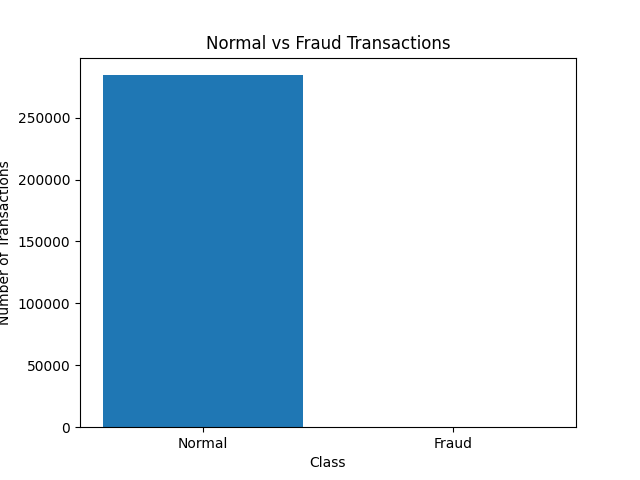
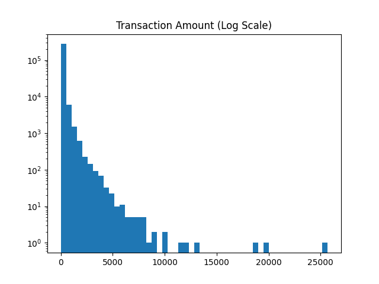
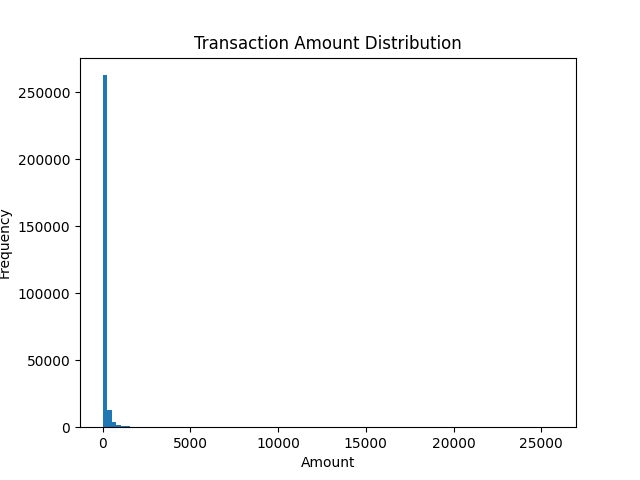
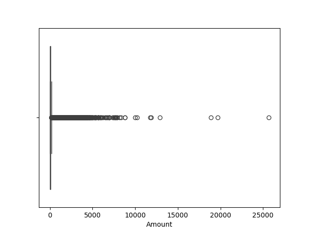
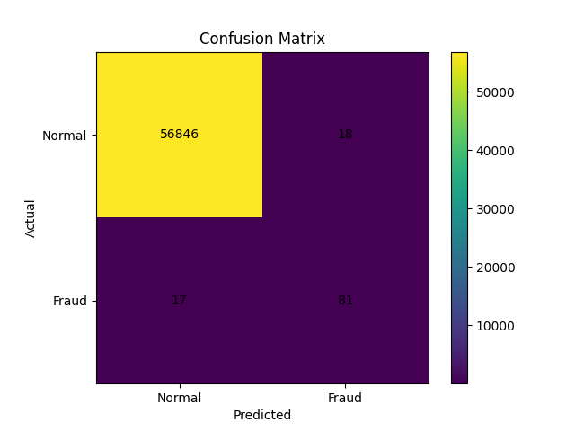
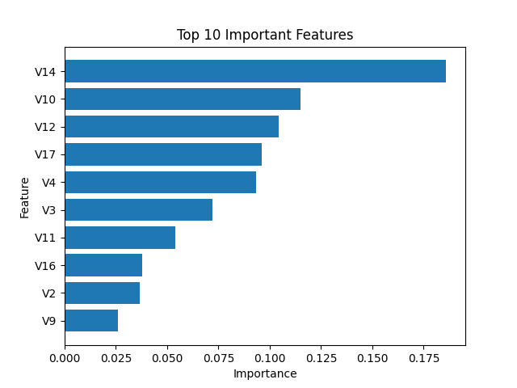

# Fraud Detection Project

This project detects suspicious credit card transactions using Random Forest.

## Dataset
The dataset contains credit card transactions.  
The target column is `Class`:
- 0 = Normal transaction
- 1 = Fraud transaction

The features `V1` to `V28` are anonymized PCA features.

## Tools
- Python
- Pandas
- Matplotlib
- Scikit-learn

## Project Steps
1. Load the dataset
2. Explore the data
3. Visualize fraud vs normal transactions
4. Train a Random Forest model
5. Evaluate using confusion matrix and classification report
6. Show top important features

## Visualizations

## Conclusion
The Random Forest model can help detect suspicious transactions and identify important features related to fraud detection.